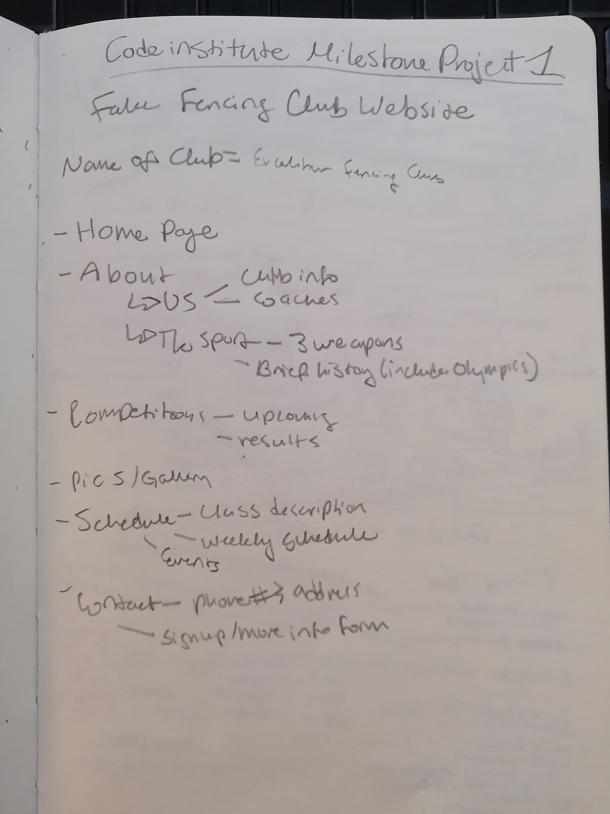
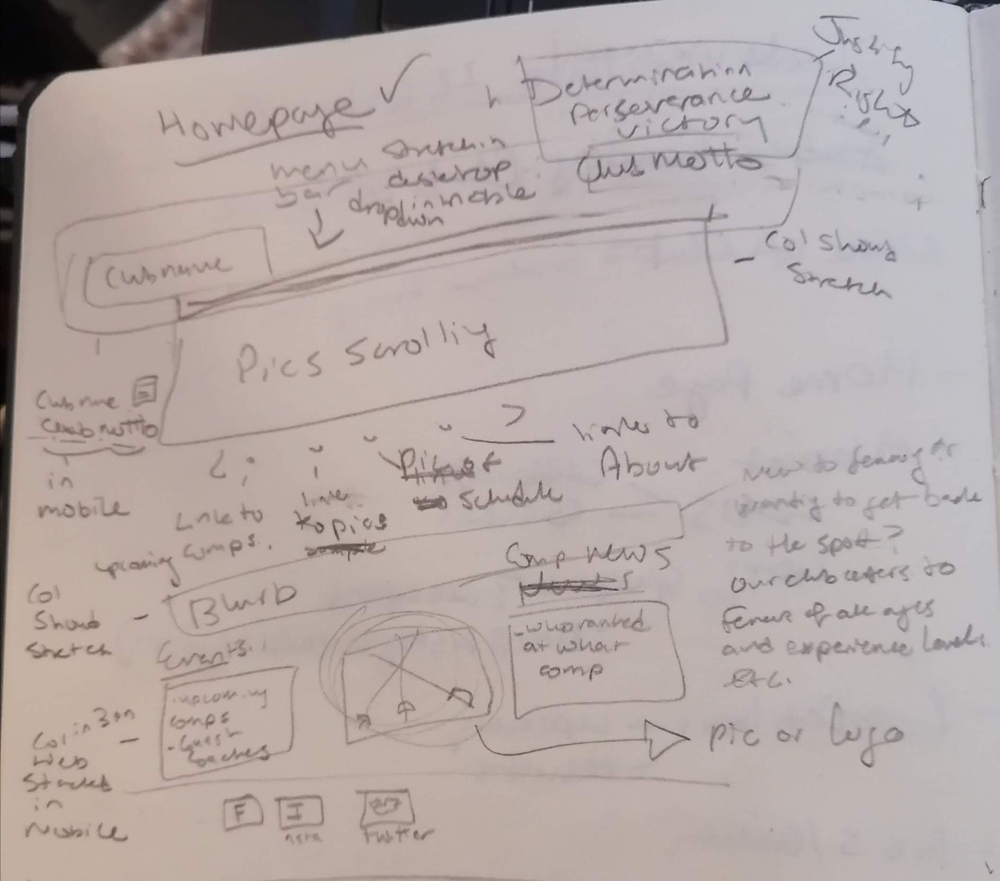
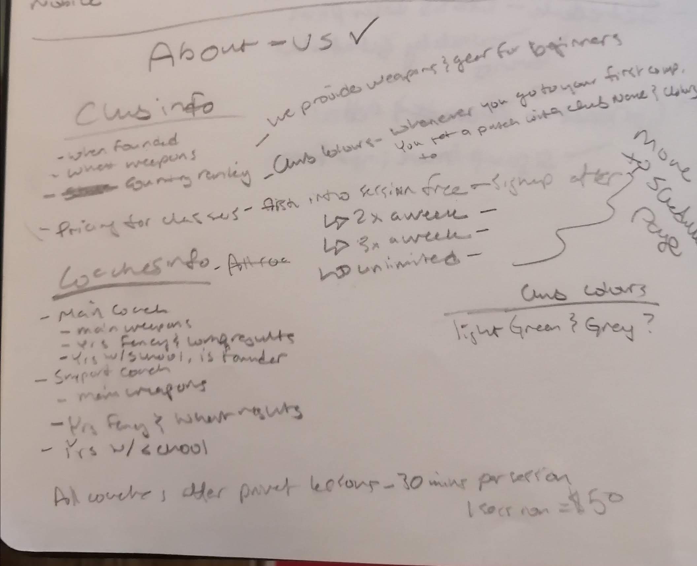
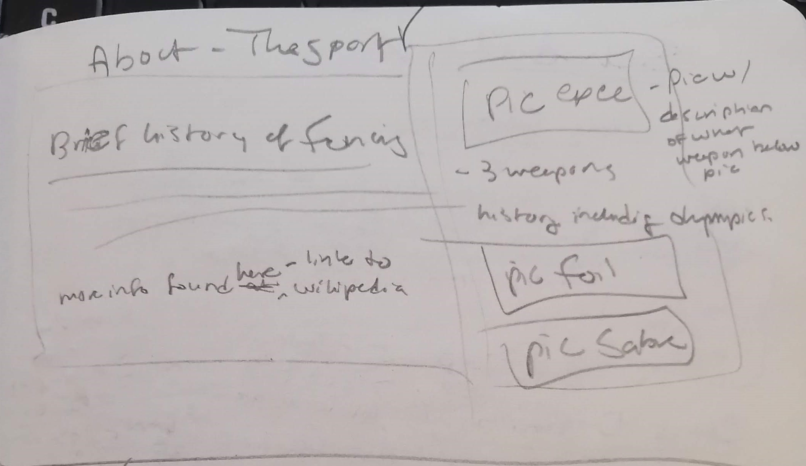
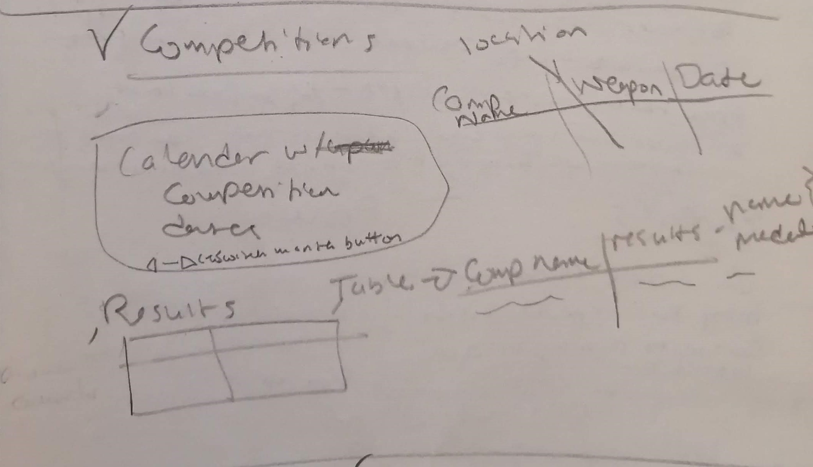
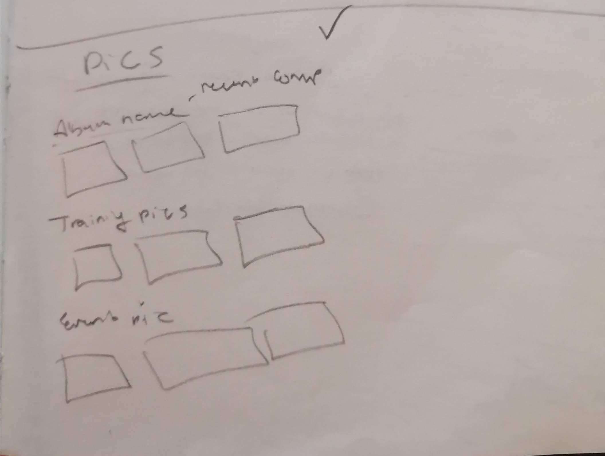
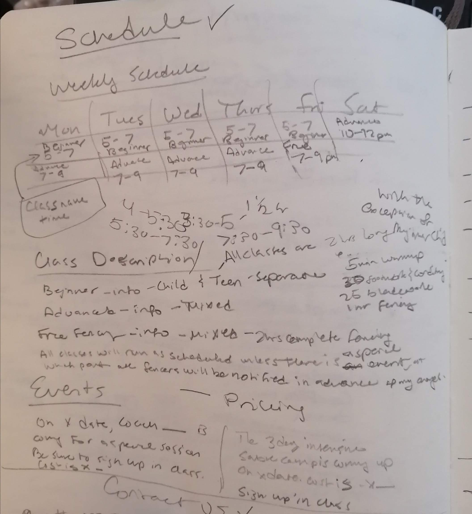
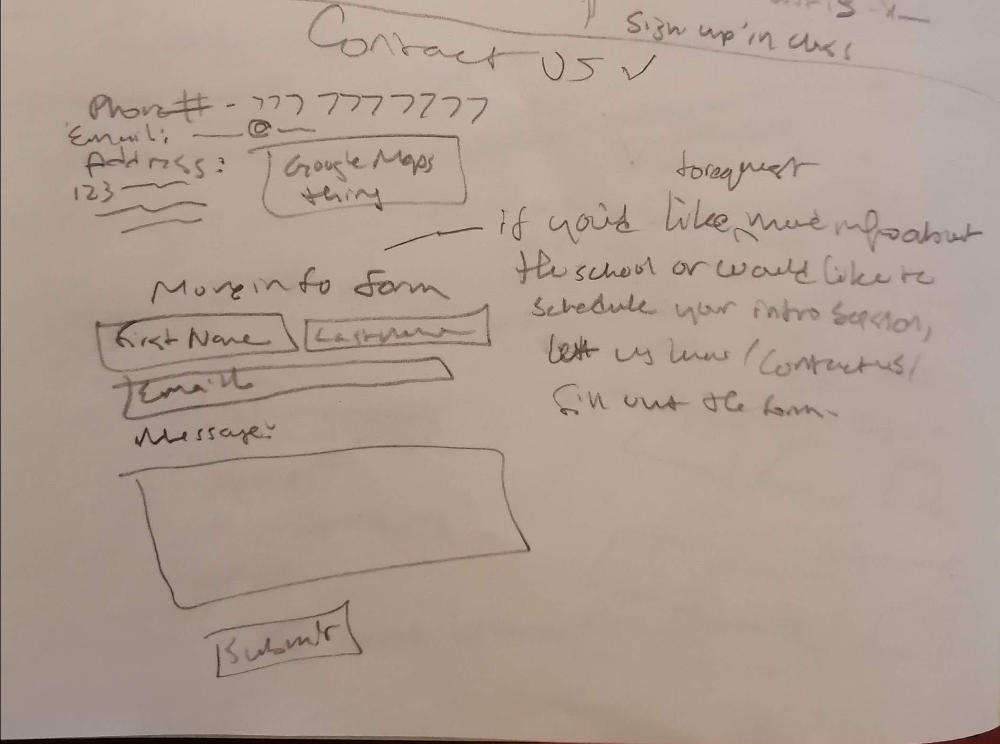

# Excalibur Fencing Club Website

The Excalibur Fencing Club website is the offical website for the Excalibur Fencing Club. It is designed to both inform new users about the fencing club- about the coaches and class schedule- and current members of the club about upcoming events and competition results.

* Link to deployed website 
* [Link to github repository](https://github.com/phoebeireland/codeinstitutemilestoneproject1)

# Contents

1. UX
2. The Website
3. Testing the Site
4. Deployment
5. Credits

# UX

## The Project- Purpose and Buisness Goals

The purpose of the website is to provide an online base for the Excalibur Fencing Club to promote itself- both by providing information for users seeking information about the club, and for users who are already familiar with the club (eg. current club members, or family members) to find out new information about upcoming events or competitions. 

Regarding the buisness perspective, the website should be informative and engaging, for the purpose of drawing new users to the website. It should also keep previous users engaged with the website on a regular basis. This website will be the place where new events and competitions are announced, so previous users will be using te website regularly. 

## User Stories
As a New User to the site, I want:
1. The ability to find out more information about fencing and this club in particular.
2. The schedule of classes for the club, and the price of those classes. 
3. Dynamic images to get me interested in the sport
4. Clean look, in which everything is readily apparent- where I need to look for certain information etc.

As a Returning User to the site, I want:
1. A site that is easy to navigate
2. TO be clearly shown where the specific information I'm looking for is on the site.
3. Informed of the latest events and news regarding the club.
4. Access to any new photos that the club has released. 

## Design Choices
The overall feel of the website should be clean and centered mainly around the information. That being said, there should not be an overload of information that might scare off new users. New users should leave feeling informed about the sport and the club, but not overwhelmed by an encyclopedia's worth of information. 

### Font
The font used on the site is Raleway. It was found on Google Fonts, and was chosen for its modern look and easy readability. 

### Icons
The icons used in the footer to represent the social media pages were chosen for their ability to convey their intended meaning clearly. 

### Colours
The main colours used on the site are:
* Gainsboro for the background colour
* Black for the font colour
* Ghostwhite for the Menu bar
* Dimgrey for the Social Media links in the Footer
* Blue for the tables

The colours were chosen due to their clean, complementary look. 

The additional grey colour that was used for a background for the text in the carousel of images in the Homepage was chosen to fit the overall grey theme to the page. There is added opacity in order for the user to still view the majority of the image, while also still being able to read the text provided. Due to the grey colour of the background, the text colour for this element was able to remain black. 

### Styling
The tables on the website were all given the same look (blue borders) for consistency. 
For the most part, all the elements on the page are given their own row. This makes for easy reading both on desktop and mobile.
The few elements that share a row are displayed one after another in desktop, and stacked in smaller screens. 

### Images
All of the images on the website were chosen due to their relevance to the topic of fencing. 
A few of the images are of Lego figures in order to keep a sense of fun regardding the sport.

## Wireframe Designs
The Wireframe designs were created in a notebook using a pencil, and the following images are photos taken from the notebook. As they are handwritten, some of the writing may not be fully legible to all readers. To combat this, I have added a typed description of all pages below the image. Please refer to those if needed.  

Please keep in mind that the drawings were the first stage of the design. and the actual website may look somewhat different from the drawings. Where the two differ, I offer an explanation as to why. 

### The Initial Overview 

This images shows a list of the pages to be included in the website. It includes the main names of the pages, as well as any initial supplimentary information regarding to the content of the proposed page. 

### The Homepage

This image shows the initial design for the homepage.
It has the club name at the top left of the screen, and the club motto at the top right. The club name would be clickable, and used to bring the user back to the homepage. Noted to the side, in mobile, the club name should be stacked on top of the club motto, with the menu bar collapsed to hamburger menu. In desktop, the menu bar will be fully displayed above the club name and the motto. (In the picture, it has the menu below, but during revision, it was advised that the menu be placed above those elements)
Underneath, there is a carousel of scrolling images, with each image containing a link to another page on the website.
Below that, is a short blurb about the website, with some sample writing to the right of the blurb box.
The last main part is the three blocks at the bottom containing the Upcoming Events, a photo and Competition News, from left to right. On the right side of the elements, it notes that in mobile, the three elements should be stacked on top of one another.
In the footer of the page would be the links to social media sites.

### About- Us

This image shows the initial design for the About- Us page.
It has two main sections- A Club Info section and a Coach Info section.
The Club info section has the general basic information about the club itself- when it was founded and what weapons it trains.
The Coach section has three subsections in which each of the three coaches are introduced and each coach has a few sentences written about them. 
The Club info section has the price information detailed here, although in the final version this was moved to the Schedule and Classes page.

### About- The Sport

This image shows the initial design for the About- The Sport page.
Initially, this page was going to have two main elements. A section on the history of fencing as a sport, and then some photos on the side.
In the final design, the history of fencing was replaced by a list of commonly used fencing terms, with a single large photo above, rather than several down the side. 

### Competitions

This image shows the initial design for the Competitions page.
The first idea was to have a calendar marking the upcoming competition, and the user would be able to scroll through the months of the year. 
This was replaced in the final design by a table, containing all of the same information.
The second element on the page is the table containing the results of the past competitions. 
In the final design, in order to make the tables compatible with smaller screens, a scroll bar was added to the x-axis in order to view all of the table. 

### Pics (changed to Gallery in the website)

This image shows the initial design for the Gallery page.
This was a simple image, only showing that there would be 3 sections to the page- each with a heading describing the group of photos below.
In the final design, there were only 2 sections. 

### Schedule (changed to Schedule and Classes in the website)

This image shows the initial design for the Schedule and Classes page.
At the top of the page, is a table with the weekly schedule of the club. It details the starting and end times for all of the classes as well as the name of each class on the particular day of the week.
In the final design, in order to make the tables compatible with smaller screens, a scroll bar was added to the x-axis in order to view all of the table. 
Below that, is the section describing each class. It details the duration of the sessions as well as a brief breakdown of the class. It was here, that the pricing was added.
Finally, This also has the Clu Events section that goes into further detail of the events mentioned on the Homepage. 

### Contact Us

This image shows the initial design for the Contact Us page.
At the top of the page is the contact information- phone number and email and address. In the final website, opening times were also added to this section.
Additionally, this section was expanded horizontally, rather than stacked as shown in the image.
Below the contact information is a form the users can fill out to request more information.
The drawing shows a basic form idea, though the final form was more detailed. To the right, is the example of the blurb to be shown above the form. 

# Features
* All pages will have a header with the Club Name at the top left, and the Club Motto on the top right. There is also a Menu bar above the Club name and motto.
* On smaller screens, the header will collapse, and the elements will stack on top of each other. 
* All pages will also have a footer containing social media links.

### The Homepage
* A scrolling carousel that displays images and links to other pages on the site. The carousel can be controlled by the user, although it will cycle through the images on its own by default. 
* A blurb section that offers users a short introduction to the club.
* A three-part section that includes Upcoming Events, a photo and Competition News. The information in these sections will be condensed, and there will be links to the relevant pages for more information.

### About-Us
* A section dedicated to an introduction and description of what the club is and does.
* A section that introduces the coaches of the club and provides a small amount of information about the coaches themselves.

### About- The Sport
* A main photo above the text content for visual interest
* A list of key fencing terms that will briefly introduce the sport and the main points of the sport a new user may find interesting.
* Links to find more detailed information about the sport and links to Youtube channels for new users to see fencing in action.

### Competitions
* A table with the upcoming fencing competitions. It contains the competition name, location, weapon, whether the competition is teams or individual, the ranking of the competition and the date on which it is to be held.
* A table with the recent competition results for club members. It contains the competition name, the name(s) of the fencer(s), the weapon fenced and the rank achieved. 

### Gallery
* Two sections with the name of the Album at the top, followed by a selection of photos underneath.

### Schedule and Classes
* A table at the top of the page that shows the weekly schedule of classes.
* A section describing the classes available and the pricing scheme of the classes.
* A section that details the Upcoming Club events. This section is an expansion of the element on the Homepage. It offers more detail as to the upcoming events and information on how to sign up to the events.

### Contact Us
* A section at the top of the page detailing opening times, a contact number and email address and a physical address of the club.
* A form that can be used by a new user in order to request more information or to sign up for a trial lesson. 

# Testing the Site

All HTML pages and CSS files were tested using the HTML and CSS Validator from W3.
* Link to the [HTML Validator](https://validator.w3.org./)
* Link to the [CSS Validator](https://jigsaw.w3.org/css-validator/)

## Manual Testing

Using the Chrome Inspect tool, the following aspects of the website were tested:
* All of the contents of the header collapsed and stacked on smaller screens.
* The navbar- collpasing on smaller screens, remaining full-sized on larger screens.
* The events, logo and club new section on Homepage- stacking on smaller screens, remaining full-sized on larger screens.
* The text on all pages were easily read on all screen sizes. 
* All of the tables included a scroll bar on the x-axis on screen sizes that were unable to accommodate the full table initially.
* All of the images scaled down to fit the different screen sizes

# Deployment
The Website was created in Visual Studio Code, version controlled with Git and hosted on Github. 

This website has been deployed to GitHub Pages- [link to website]()
Steps to publish website to GitHub Pages:
1. On the main page of the repository, click settings.
2. Scroll to the GitHub Pages section.
3. In the Source section, click "None" and change the selected branch to "main". 
4. Leave the following option as (root), and click "Save"
5. Once the repository is published, a link to the website will be shown in the GitHub Pages section. 

To Clone this repository using IDE Terminal:
1. Navigate locally to the directory in which you want to save the repository.
2. On the main page of the repository, click the "Code" button, and copy the HTTPS address.
3. In the terminal, run the command: 'git clone' followed by the HTTPS address.
4. The project will now be saved to the desired directory. 

To Clone this repository using Visual Studio Code:
1. Open a new window in VSCode.
2. On the main page of the repository, click the "Code" button, and copy the HTTPS address.
3. Back in VSCode, under "Start" click "clone repository" and paste the link into the textbox that pops up.
4. Navigate into the folder that you want the repository to be saved into, and "Select Repository Location".
5. The repository will now be saved to the selected location.

# Credits

Created by Phoebe Ireland

The content of this website was created by Phoebe Ireland, with the exception of the following:
* [Google Fonts](https://fonts.google.com/)
  * Used to apply the Raleway font to all pages
* [Bootstrap](https://getbootstrap.com/)
  * Used to create the navbar in the header element of all pages
  * Used to create the carousel of images in [index.html](index.html) 
  * Used to add a talbe border to the tables in [competitions.html](competitions.html) and [schedule.html](schedule.html)
* Code Institute's Love Running Project
  * Used to create the social media links in the footer element of all pages
  * Used to style the social media links in the footer element of all pages
  * Used to style the 3 bottom row elements on the homepage
* [Font Awesome](https://fontawesome.com/)
  * Used to add the social media logos in the footer element of all pages
* Code Institute's Coder's Coffeehouse Project
  * Used to create the Contact Information section in [contactus.html](contactus.html)
  * Used to style the Contact Information section in [contactus.html](contactus.html)
* [Unasplash](https://unsplash.com/)
  * Used for images on the site
* [FreeImages](https://www.freeimages.com/)
  * Used for images on the site
* [Pexels](https://www.pexels.com/)
  * Used for images on the site.  
   
   All of the content that was taken from other sources was altered to fit the use of this website where necessary (ie. not the images).

A special thank you to my mentor for helping me though the project, and pointing out my (numerous) mistakes. 